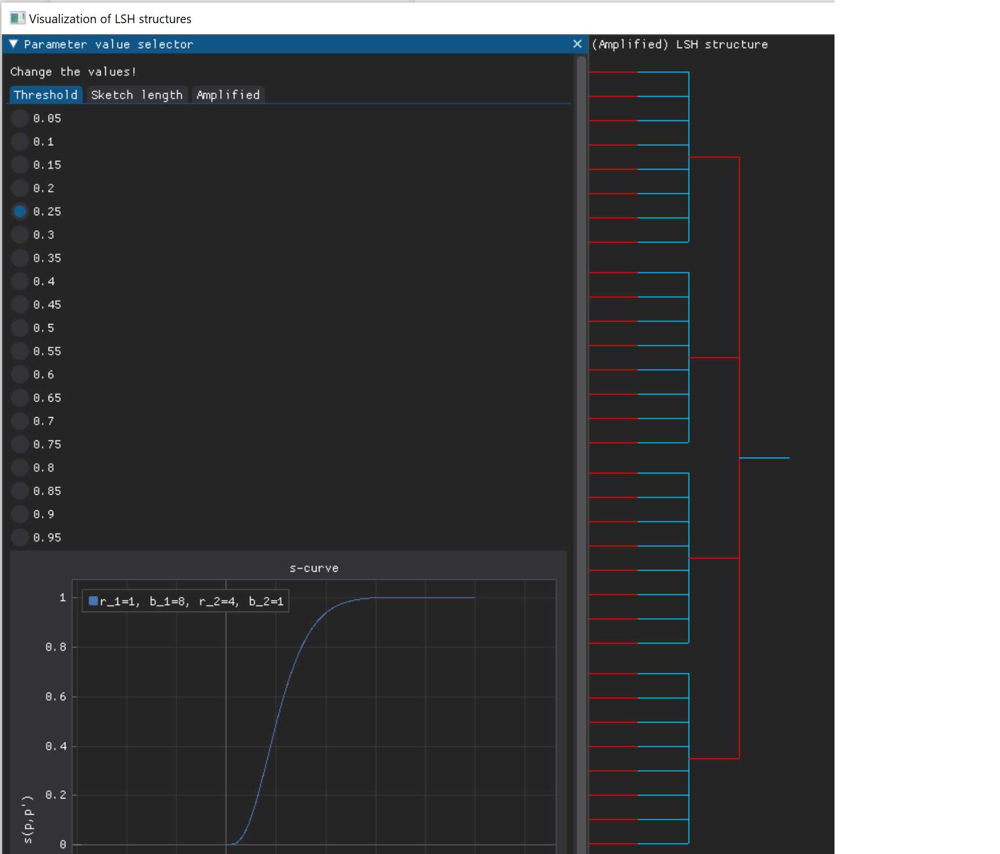
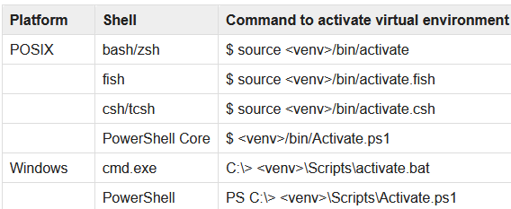
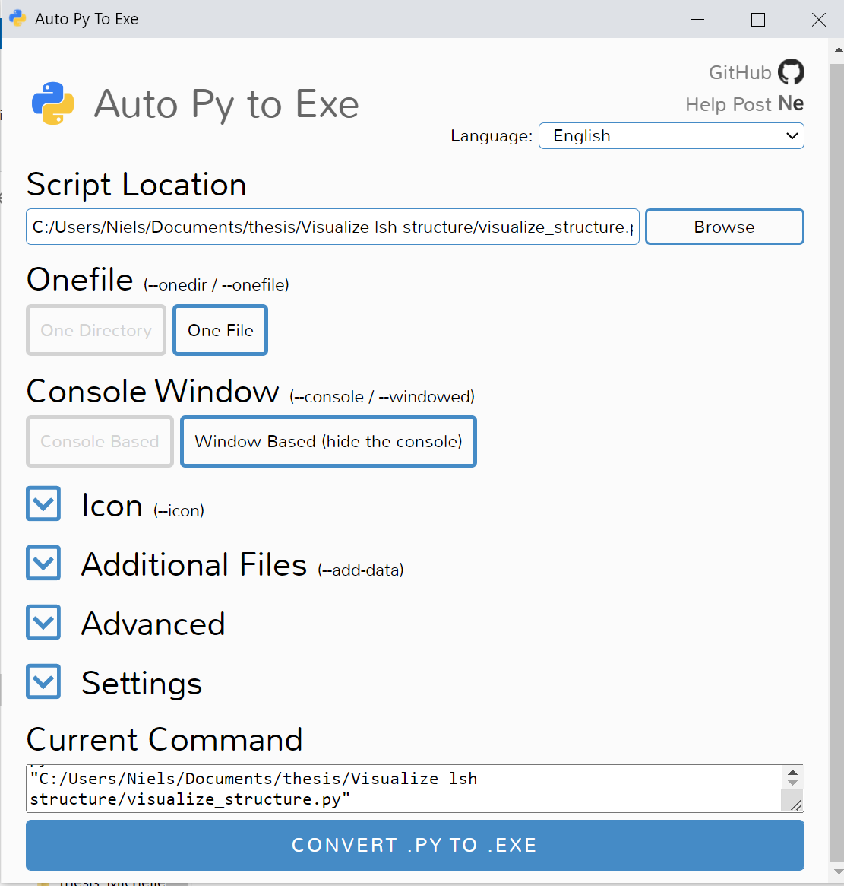
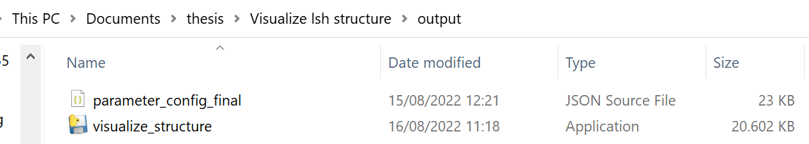

# LSH structure visualizer module

- [LSH structure visualizer module](#lsh-structure-visualizer-module)
  - [Introduction](#introduction)
  - [Set-up](#set-up)
  - [Run](#run)
  - [How-to generate executable](#how-to-generate-executable)
## Introduction

With this module, users can generate a visualization of optimal LSH  structure. There are three inputs that can be changed:
- The length of the sketch / number of hash functions
- The threshold value
- A boolean variable 'amplified' that indicates whether two stages are allowed in the LSH structure

## Set-up

In order for a smooth running experience, we advise you to use a virtual environment, which can be create with the following command in the terminal.

``
python -m venv /path_to_virtual_env
``

Then activate the virtual environment (for windows, with powershell)

``
/path_to_virtual_env/Scripts/activate.ps1
``
For other operatings systems and terminals, see the table below.

The required python packages are listed in requirements.txt. 

``
python -m pip install -r requirements.txt
``

## Run
Run
``
python visualize_structure.py
``
## How-to generate executable
Run
``
auto-py-to-exe
``

Select the following settings: 
- One File
- Window Based (hide the console)
  

Click on 'CONVERT .PY TO .EXE'

Now the .exe application file is placed in the output folder. 
The output folder should now look like this.

If you click the visualize_structure.exe application file, the application should run.
Final note: The parameter_config_final.json should always be placed in the same folder in order for the application to run.